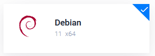
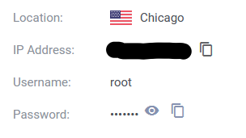

# Step 1: Getting a cloud server (**VPS**) with a public IP

The first step is of course actually getting a cloud server that runs Debian 11 and has a public IP, think of a cloud server as essentially a virtual computer (in this case running Debian 11 Linux) that you can remotely access from anywhere in the world.

There are **TONS** (and I really do mean **TONS**) of cloud providers out there, however my absolute favorite and one I will be using for this tutorial is [**Vultr**](https://www.vultr.com/), as from what I have found over time, they consistently seem to have the best price/performance, have an extremely simple UI, and a location that is very close to me.

**Once you have an account and are on the products page, click on the blue plus button near the top right:**

Then you will be on a page to create the server, be sure to select **Cloud Compute** (not optimized) and **Intel Regular Performance** below that, there is really no reason for anything more powerful just for a simple static site.

Next, choose the location that is the closest to you.

And then make sure **Debian 11** is selected as the Operating System/Distro/"Server Image":

Now, select the cheapest plan **that does not say "IPV6 ONLY"**, this may vary based on the location you selected.

Finally, enable/disable Auto Backups if you wish.

As I mentioned above, I also highly recommend disabling IPV6 entirely at the bottom checkboxes, this (in my opinion) will only create more confusion/issues and is not needed whatsoever:

Now, create the server and simply wait for it to finish installing/for the status to say **Running** in the products list, click on it, and now near the bottom left you will see all the connection info you need:

**Congratulations!** You now have a cloud server! Next, we will connect to it remotely with **SSH**.

[[Next Step]](step2.md)
