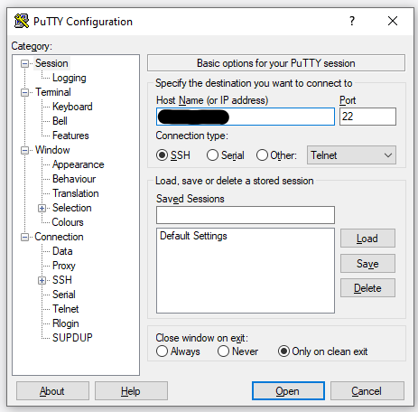
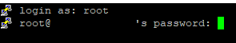
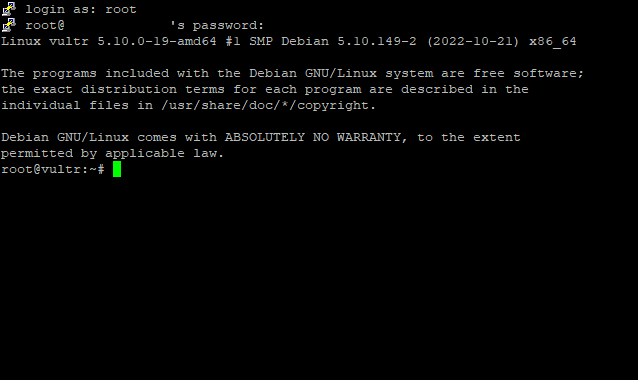

# Step 2: Accessing that server via **SSH**, and updating it

The next step is of course to actually remotely connect to your server using SSH, depending on your machine's OS this may vary, however on Windows [PuTTY](https://www.chiark.greenend.org.uk/~sgtatham/putty/latest.html) is by far the easiest with its simple GUI.

As mentioned before, you will need the connection info, on **PuTTY Windows** you will paste the IP Address in that field, and leave port 22 as it is (default), and then press "Open", **you may be asked if you want to add the server's host key, press "Accept"**:



You will then be asked for the username in the "login as" prompt, this is of course **root**, then you will copy/paste your password when it asks for it **you may not see it appear, but it is there**:



After successfully logging in, you will simply see some info and a command prompt, **this is where you want to be**:



Now, the first thing that you should do (in my opinion) for best practice on any new server is to update it, on Debian this is relatively simple, you just need to run a few commands, you should not have any errors with this:

1. ```sudo apt-get update``` (updates the available package information, **does not download any packages**)
2. ```sudo apt-get upgrade``` (updates/downloads the new packages)

Next, we will make sure that the web server/HTTP port (80) will be publicly accessible from the UFW/iptables firewall.

[[Next Step]](step3.md)
