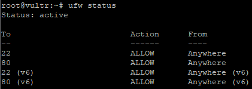

# Step 3: Ensuring Port 80 (HTTP) is publicly accessible

As mentioned before, you will need to make sure that Port 80, which is the default port for HTTP, is opened on your firewall. By default this particular image of Debian 11 comes with **UFW** and **iptables** installed/enabled, **UFW** is simply a far easier way to manage the actual firewall on Linux, which is **iptables**.

In order to do this, you only need a few commands, but first notice that when you run ```ufw status``` it only shows Port 22 as being open, remember this is how you are connected over SSH.

As far as the commands, they are relatively simple:
1. ```ufw allow 80``` (allows port 80 to be accessible)
2. ```ufw reload``` (reloads UFW/iptables so that everything works)

Now, if you try ```ufw status``` again, it should show Port 22 and 80 as being open:



Next, we will move on to actually installing Apache

[[Next Step]](step4.md)
