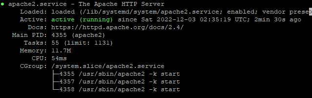
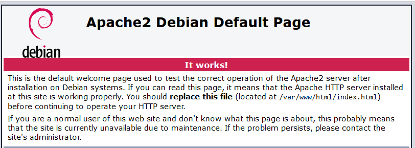

# Step 4: Installing Apache and ensuring the service is started/enabled

Installing Apache (the actual web server) is actually quite simple, assuming you are still logged into your server via SSH, and have made sure to update everything, you should really only have to run:

```sudo apt-get install apache2``` (It may ask you if you want to continue, **answer "Y"**

As I said before, this one command **should** install the Apache program and service, as well as start and enable the service so that it starts on startup, keep in mind that the service is not the same as the Apache program, it simply keeps it running in the background.

Assuming everything was successful, running ```service apache2 status``` should show **active (running)**:



If this is not the case, then you can manually start the service with ```service apache2 start``` and enable it so that it will start on startup with ```systemctl enable apache2```, you shouldn't have any errors with this.

**If all is well, visiting the IP address in your browser should now display the default webpage!**



Next, we will go over replacing/editing the default hosted page.

[[Next Step]](step5.md)
