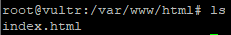

# Step 5: Editing/Changing the default hosted HTML page

Finally, it's time to actually change what we are hosting, this is actually a relatively simple process, by default all hosted files **should** be located in ```/var/www/html```, however this may differ on other Linux Distros.

As with Linux, you can change to that directory by running ```cd /var/www/html``` and list the files with ```ls```, which should only display one file, ```index.html```, which is the root page that will be displayed when the IP or Domain is requested.



And now you can simply either edit the existing HTML file with a text editor such as **nano** (```sudo nano index.html```) or delete the file entirely (```rm index.html```) and place in your existing HTML site files with ```git``` or any other file transfer method (even copy/pasting with nano)!

**And that's a wrap! I hope this tutorial is useful, and that it explained everything relatively well!**
